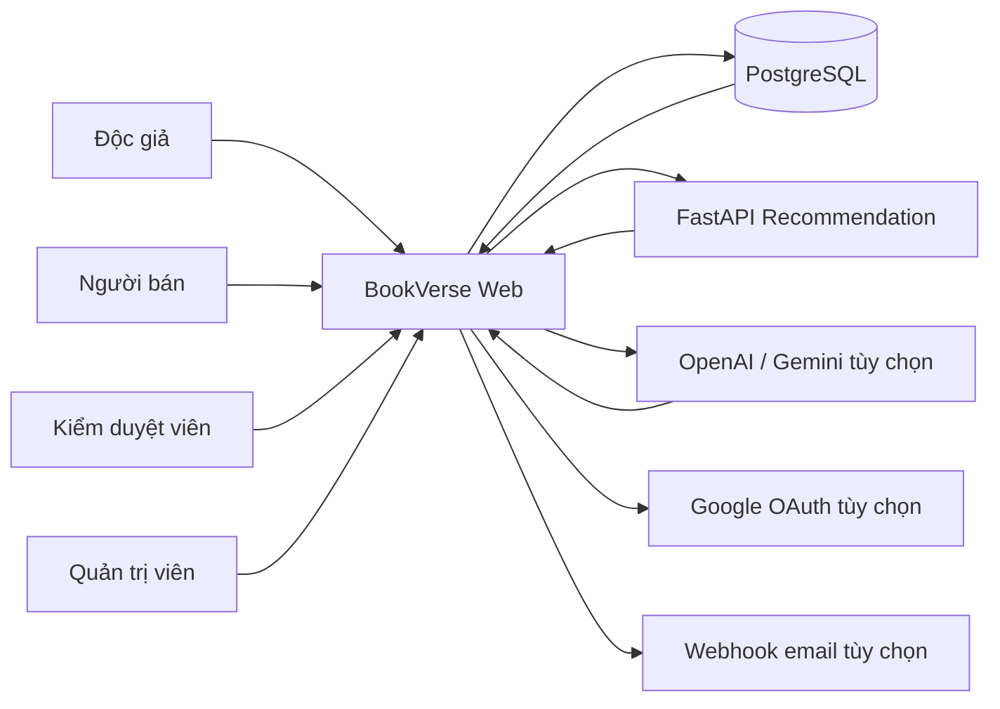
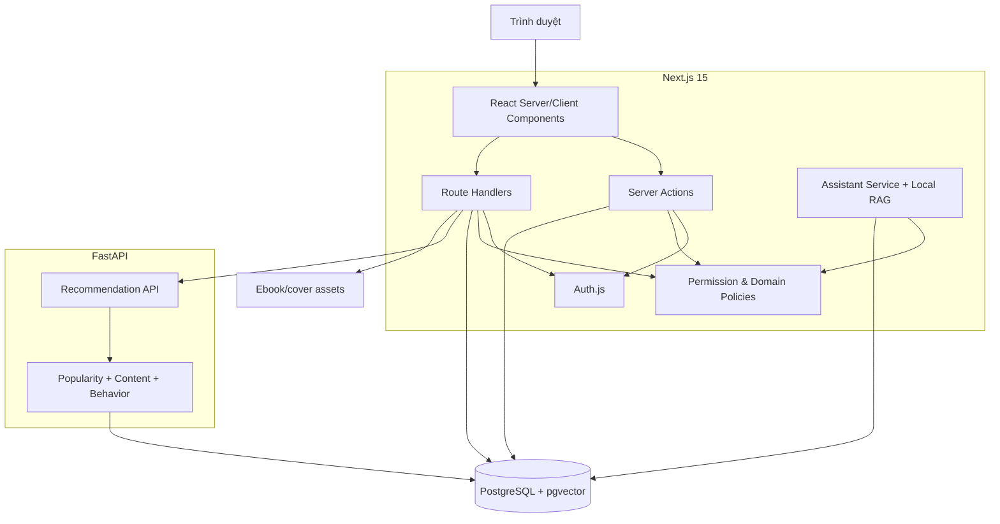
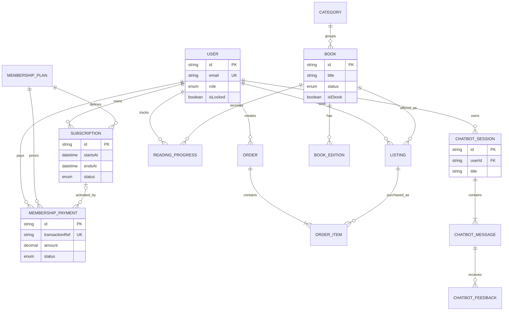
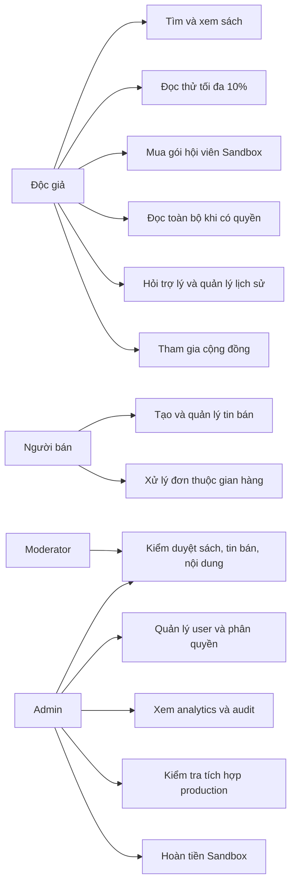
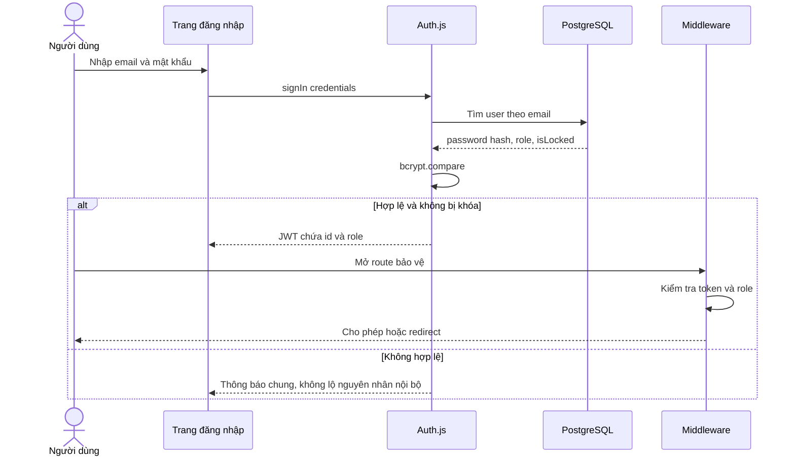
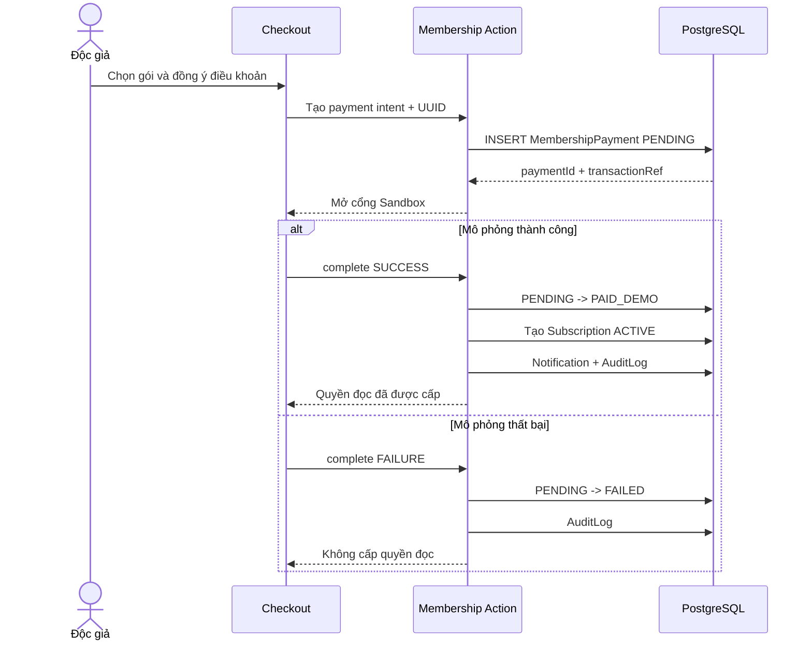
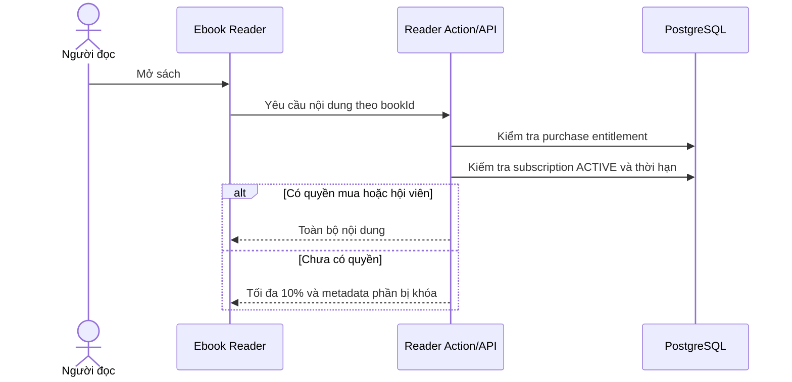
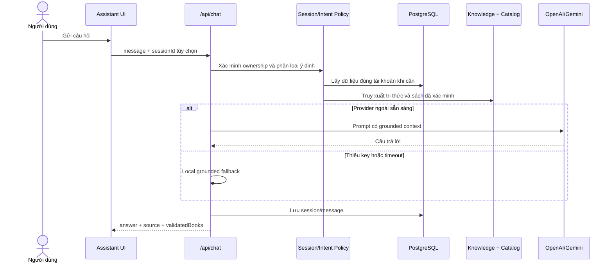

# Kiến trúc và luồng nghiệp vụ BookVerse AI

Tài liệu này là bản rút gọn để đưa vào báo cáo và slide bảo vệ. Các sơ đồ dùng
Mermaid, có thể hiển thị trực tiếp trên GitHub hoặc xuất thành ảnh bằng Mermaid
Live Editor.

## 1. Sơ đồ ngữ cảnh hệ thống

BookVerse vẫn hoạt động ở chế độ demo khi các tích hợp bên ngoài chưa có
credential: đăng nhập email, local grounded RAG, catalog, trình đọc và Sandbox
được giữ nguyên.

## 2. Kiến trúc container

## 3. ERD nghiệp vụ cốt lõi

Đây là ERD rút gọn. Prisma schema vẫn là nguồn chính xác cho toàn bộ field và
constraint.

## 4. Use Case theo vai trò

## 5. Sequence đăng nhập và phân quyền

## 6. Sequence thanh toán hội viên Sandbox

## 7. Sequence kiểm tra quyền đọc Ebook

## 8. Sequence chatbot grounded RAG

## 9. Ma trận phân quyền rút gọn

| Chức năng | Khách | Độc giả | Seller | Moderator | Admin |
|---|---:|---:|---:|---:|---:|
| Xem catalog/hội viên | Có | Có | Có | Có | Có |
| Đọc thử | Sau đăng nhập | Có | Có | Có | Có |
| Đọc toàn bộ | Không | Khi có quyền | Khi có quyền | Khi có quyền | Khi có quyền |
| Xem dữ liệu cá nhân | Không | Chính mình | Chính mình | Chính mình | Chính mình |
| Quản lý tin bán | Không | Không | Tin của mình | Kiểm duyệt | Toàn quyền |
| Admin Center | Không | Không | Không | Có giới hạn | Có |
| Đổi role/khóa user | Không | Không | Không | Không | Có |
| Hoàn payment Sandbox | Không | Không | Không | Không | Có |

Server Action và Route Handler tiếp tục kiểm tra quyền dù middleware đã chặn
điều hướng. Middleware chỉ là lớp bảo vệ sớm, không phải lớp bảo mật duy nhất.

## 10. Điểm cần trình bày trung thực

- Payment là Sandbox, không chuyển tiền thật.
- Catalog và hành vi hiện chủ yếu là dữ liệu demo/synthetic có ghi nhãn.
- Local RAG là fallback đã xác minh, không được gọi là OpenAI/Gemini khi chưa có
  API key.
- Recommendation offline hiện chưa chứng minh hiệu quả thương mại; CTR
  production vẫn `NOT_AVAILABLE`.
- Google OAuth, email và provider ngoài chỉ được xem là production-ready khi
  `/admin/integrations` báo đủ cấu hình.
